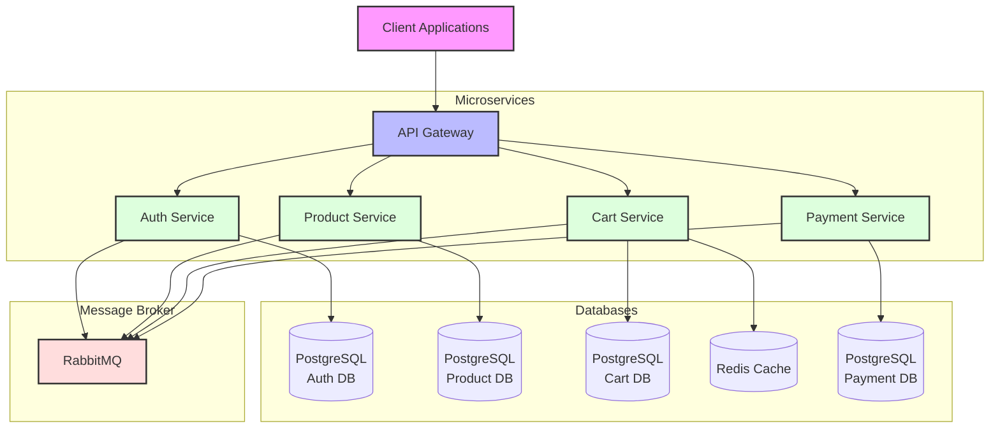

# 🛍️ MogroShop Microservices

A cloud-native e-commerce platform leveraging Docker and Kubernetes orchestration, with Redis caching and RabbitMQ message broker for high-performance microservices architecture.

## 📋 Table of Contents

- [Overview](#-overview)
- [Architecture](#-architecture)
- [Services](#-services)
- [Getting Started](#-getting-started)
- [API Documentation](#-api-documentation)
- [Deployment](#-deployment)

## 🎯 Overview

MogroShop is a robust, cloud-native e-commerce platform designed with scalability and resilience in mind. Built using modern microservices architecture, it leverages the power of .NET 8, Docker, and Kubernetes to provide a seamless shopping experience.

## 🏗️ System Architecture

## 🔄 Service Communication Flow

## 🚀 Services

### 🔐 Auth Service (Port: 5062)
User management and authentication service.

### 📦 Product Service (Port: 5167)
Product catalog and inventory management.

